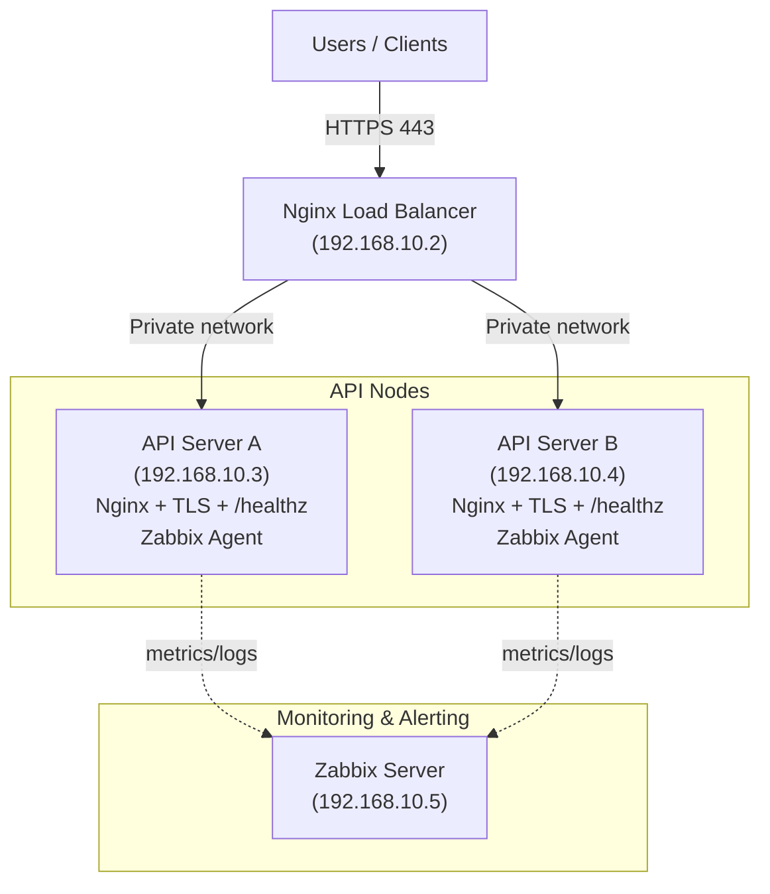
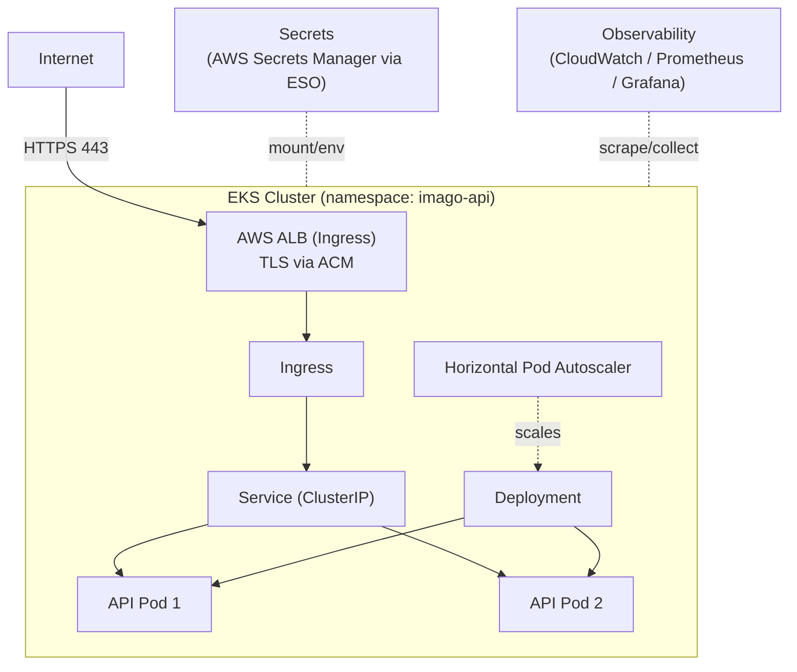

# IMAGO – DevOps & Infrastructure Challenge C3
**Author:** Mohammed Shabaaz Ahmed  
**Date:** August 11, 2025

This project provisions a **robust, scalable, observable API platform** using **Linux VMs, Nginx (HTTPS), Ansible automation, and Zabbix monitoring**.  
It supports **blue/green deployments**, rollback, and includes a **simple EKS migration plan**.  
The production-ready **GitLab CI pipeline** is in `.gitlab-ci.yml` (no extra CI instructions here).

---

## 1) Architecture Overview

### 1.1 Current VM-Based Setup (built by this repo)



### 1.2 Future (Recommended) – Simple EKS Layout



---

## 2) Inventory

`inventory/hosts.ini`
```ini
[web]
api-a ansible_host=192.168.10.3 ansible_user=ubuntu
api-b ansible_host=192.168.10.4 ansible_user=ubuntu

[lb]
lb-1 ansible_host=192.168.10.2 ansible_user=ubuntu
```

---

## 3) What’s Included

**Ansible Roles**
- `nginx_tls` – Installs Nginx, configures self‑signed TLS, `/healthz`, enables site.
- `zabbix_agent` – Installs Zabbix Agent 2 using official repository.
- `lb` – Nginx reverse proxy with TLS (self‑signed default, Let’s Encrypt optional), upstreams to A/B.

**Playbooks**
- `playbooks/site.yml` – provision API Servers (A & B).
- `playbooks/lb.yml` – configure Load Balancer (HTTPS + upstreams).
- `playbooks/maintenance.yml` – patch + conditional reboot.
- `playbooks/lb_drain.yml` / `playbooks/lb_enable.yml` – blue/green backend drain/enable.
- `playbooks/rollback.yml` – restore the previous Nginx site backup.

**CI/CD**
- See `.gitlab-ci.yml` for the pipeline (test → build → deploy → verify → rollback).

---

## 4) Step-by-Step Deployment

### 4.1 Provision API Servers
```bash
ansible-playbook -i inventory/hosts.ini playbooks/site.yml
```
Installs Nginx with `/healthz`, creates self‑signed TLS, installs Zabbix Agent 2 (to `192.168.10.5`).

### 4.2 Provision Load Balancer
```bash
ansible-playbook -i inventory/hosts.ini playbooks/lb.yml
```
Installs Nginx, configures upstreams to A/B, enables TLS (self‑signed by default; Let’s Encrypt optional).

### 4.3 Test
```bash
curl -vk https://192.168.10.3/healthz
curl -vk https://192.168.10.4/healthz
curl -vk https://192.168.10.2/healthz
```

---

## 5) TLS Options

**Self‑Signed (Default)** – works in private/demo environments (browser warning expected).  
**Let’s Encrypt (Recommended)** – set `lb_use_letsencrypt: true` in `group_vars/lb.yml`, point DNS to LB, open ports 80/443.

---

## 6) Observability
- **Zabbix Agent** on each node → **Zabbix Server** `192.168.10.5`.
- Future: Prometheus + Grafana, centralized logs (Loki/ELK).

---

## 7) Simplified EKS Migration (Best‑Practice Path)

**Why EKS:** Autoscaling, rolling updates, ACM TLS, IAM, less ops overhead.

**Steps:**
1. Containerize API; push to **ECR**.
2. Provision **EKS** (Terraform/eksctl); multi‑AZ node groups.
3. Install **ALB Ingress Controller**; get TLS certs via **ACM**.
4. Deploy API with **Helm/Kustomize** (Deployment, Service, Ingress + HPA).
5. Use **External Secrets Operator** with **AWS Secrets Manager**.
6. Observability via **CloudWatch** and/or **Prometheus + Grafana**.
7. CI updates image tag and runs `helm upgrade --install` (or `kubectl apply -k`).

---

## 8) Troubleshooting (Quick)
- **Ansible fact gather fails (six.moves)** → use a fresh venv, `ansible==9.*`, clear `~/.ansible/tmp` locally & on targets.
- **LB not reloading** → ensure the `lb` role has a `Reload nginx` handler; handlers fire only on change.
- **HTTPS “Not Secure”** → expected with self‑signed; use Let’s Encrypt for trusted certs.
- **Health check fails** → verify upstream IP/ports, SG/firewall, backend `/healthz` returns 200.

---

**© August 11, 2025 – Mohammed Shabaaz Ahmed**
